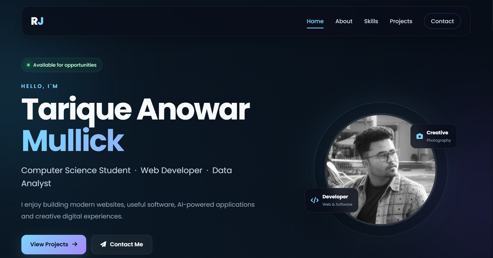

<div align="center">

# ✦ PERSONAL PORTFOLIO

### A Modern Glass UI Personal Portfolio Website

**A digital space to showcase my profile, skills, projects and journey.**

<br>

[](#)
[](#)
[](#)
[](#)

<br><br>

### 🌐 Explore the Portfolio

[]([YOUR_LIVE_LINK](https://vercel.com/ramijrjmullick-gmailcoms-projects/portfolio-tarique))

[](https://github.com/Tarique-A-Mullick/Portfolio_Tarique)

</div>

---

<div align="center">

## ━━━━━━━━━━━━━━━━━━━━━━━━━━━━━━━━━━━━━━━
## ✦ PROJECT SHOWCASE ✦
## ━━━━━━━━━━━━━━━━━━━━━━━━━━━━━━━━━━━━━━━

<br>



<br><br>

**Personal Portfolio — Main Interface**

</div>

---

# 👋 About The Project

This project is my **personal portfolio website**, designed to work as a
digital resume and a central place to showcase my background, technical
skills, projects and contact information.

The website focuses on a clean and modern **Glass UI / Glassmorphism**
design while maintaining a responsive experience across different
screen sizes.

---

# ✨ Features

<table>
<tr>
<td width="50%">

### 🧭 Navigation

- Sticky navigation bar
- Active navigation highlight
- Smooth scrolling

</td>

<td width="50%">

### 👤 Profile

- Hero section
- Profile information
- About Me section
- Personal introduction

</td>
</tr>

<tr>
<td>

### 💻 Projects

- Featured projects
- Project descriptions
- Project showcase layout

</td>

<td>

### 🛠️ Skills

- Skills grid
- Technical skills showcase
- Clean visual presentation

</td>
</tr>

<tr>
<td>

### 📧 Contact

- Contact information
- Easy connection options
- Social links

</td>

<td>

### 📱 Responsive

- Desktop friendly
- Laptop friendly
- Tablet friendly
- Mobile friendly

</td>
</tr>
</table>

---

# 🛠️ Technology Stack

<div align="center">

| Technology | Purpose |
|---|---|
| **HTML5** | Website structure |
| **CSS3** | Styling, layout and visual design |
| **JavaScript** | Interactions and animations |
| **Glassmorphism** | UI design system |
| **CSS Animations** | Visual interactions |
| **Responsive CSS** | Multi-device support |

</div>

---

# 📂 Project Structure

```text
Personal_Portfolio/
│
├── 📄 index.html
├── 🎨 style.css
├── ⚙️ script.js
├── 📖 README.md
│
└── 🖼️ images/
    ├── profile.jpg
    ├── moodmeta.jpg
    ├── studychange.jpg
    └── portfolio-preview.jpg
